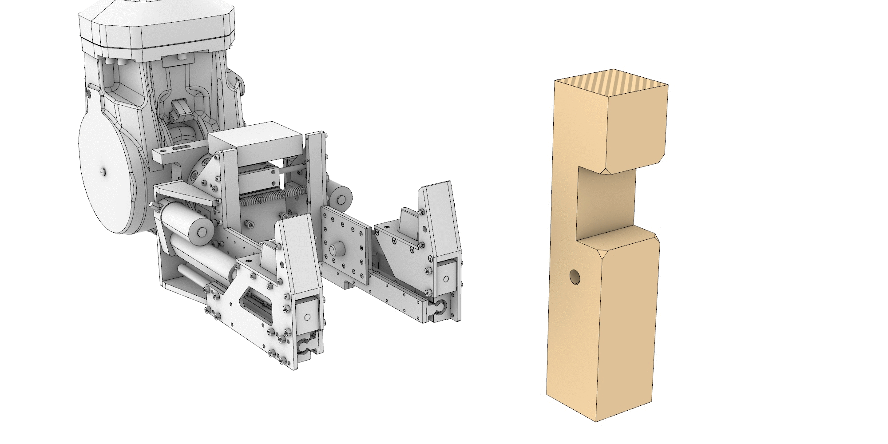

Process Design / Timber Joints Assembly by Robotic Clamps
=========================================================

A novel robotic end-effector is used.

A novel robotic end-effector is used.

A novel robotic end-effector is used.

A novel robotic end-effector is used.

A novel robotic end-effector is used.

