# Ball Screw and Geared DC Motor Test

The goal of this test is to verify the newly sourced ball screw and the DC motor can deliver forces that are higher than the previous actuator (~200kg). 

Items new in this test:

- 36GP - 555 DC Motor with Hall Effect Encoder
- Hiwin Compatible Ball Screw 1204 300mm
- Hiwin Compatible Ball Nut 1204
- Hiwin Compatible Screw Support - BK10
- Shaft Coupler

## Test Setup

### Motor - 36GP-555

 https://item.taobao.com/item.htm?spm=a1z09.2.0.0.32392e8dqyPg5S&id=544216961663&_u=jl5jjmhf0dd 

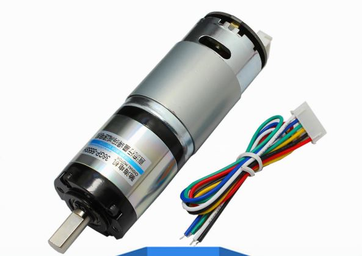

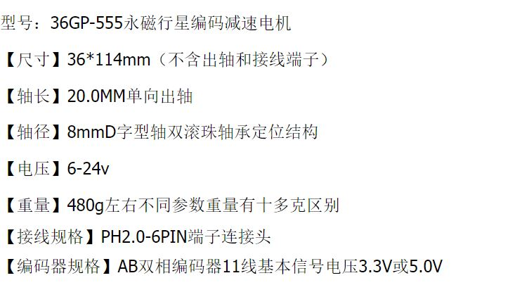

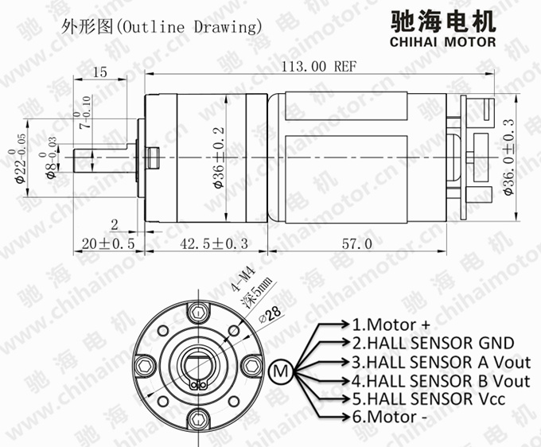

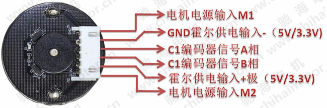

Two motors gearbox are tested:

According to specification:

| Gearbox Ratio | 12V No Load Speed | 12V Loaded Speed | Rated torque [Kg.cm] |
| ------------- | ----------------- | ---------------- | -------------------- |
| 1:51          | 115 rpm           | 95 rpm           | 3.43                 |
| 1:100         | 60 rpm            | 45 rpm           | 4.90                 |

### Ball Screw 1204 

Ball screw ordered from TaoBao, model number is SFU1204

Similar product can be found in HiWin:   [RBS-R12-4B1-FSB-200-261-0.05](https://motioncontrolsystems.hiwin.com/item/ballscrews-main-configurator/ballscrews-main-configurator/rbs-r12-4b1-fsb-200-261-0-05) 

3D Model found on GrabCAD:  https://grabcad.com/library/sfu1204-500mm-with-bk10-bf10-set-1 

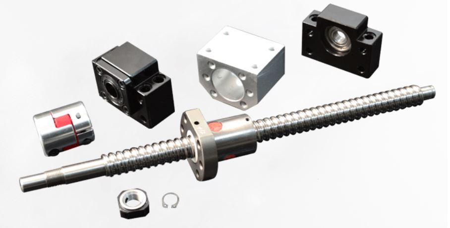

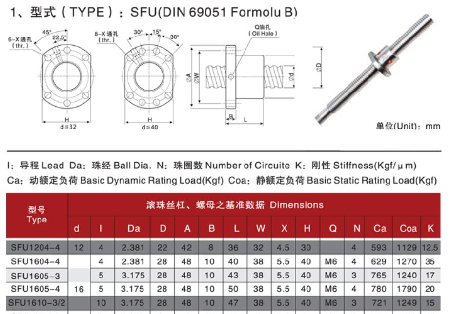

### Support BK10

BK10 was used with another end being free end. 

3D model was found in HiWin: [BK10](https://motioncontrolsystems.hiwin.com/item/all-categories/support-units-bk-series/bk10?plpver=1001) 

Another similar model FK10 can be used too but not tested: [FK10](https://motioncontrolsystems.hiwin.com/item/all-categories/support-units-fk-series/fk10-a)

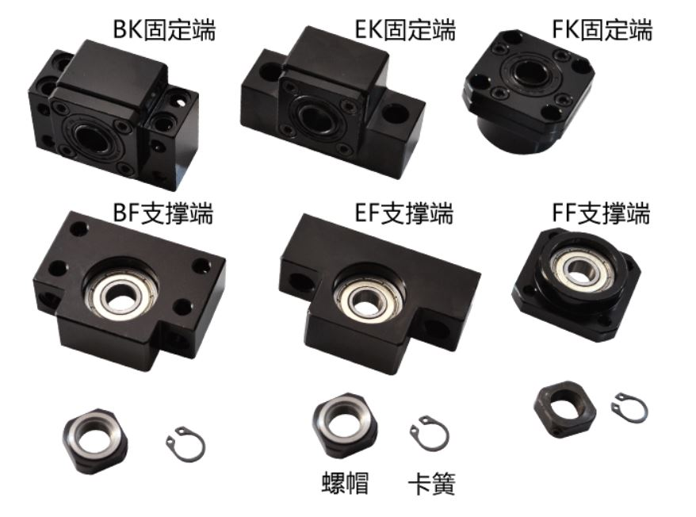

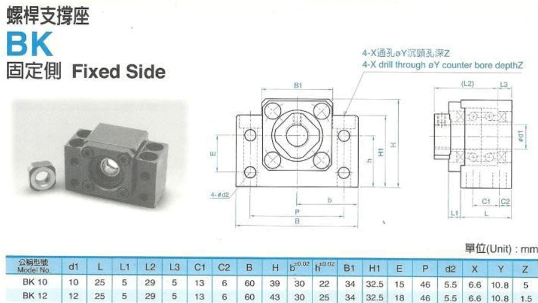

### Shaft Coupler SRJ-25C

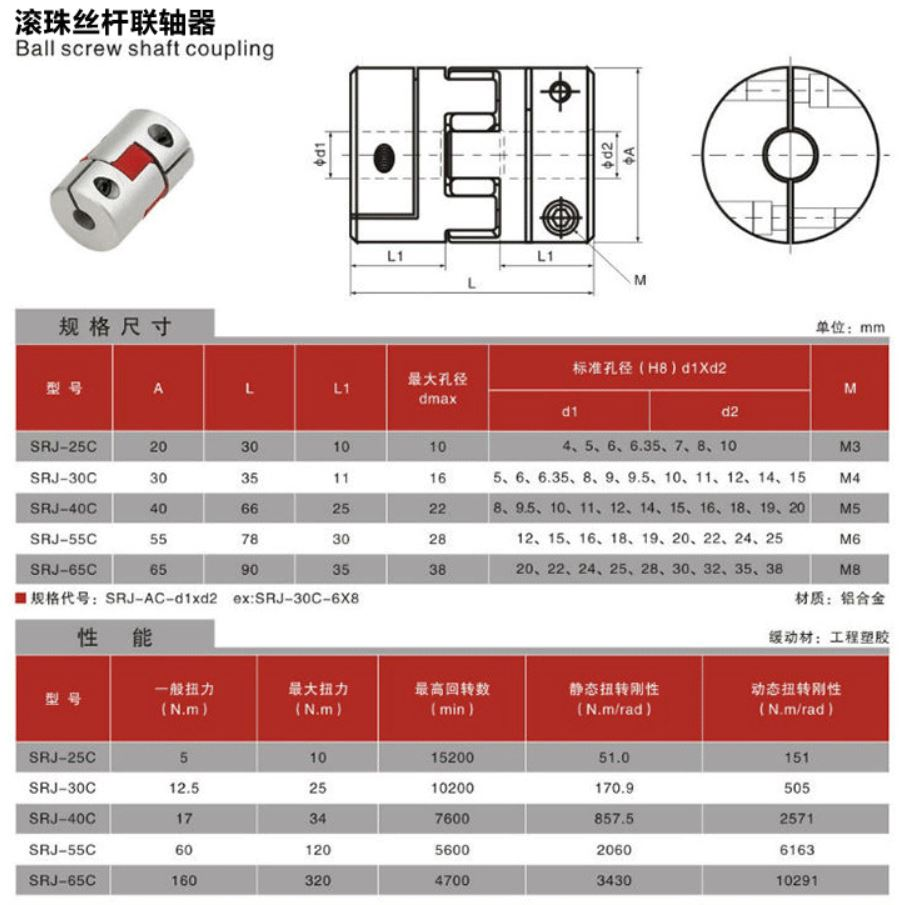

### Nut Support DSG12H

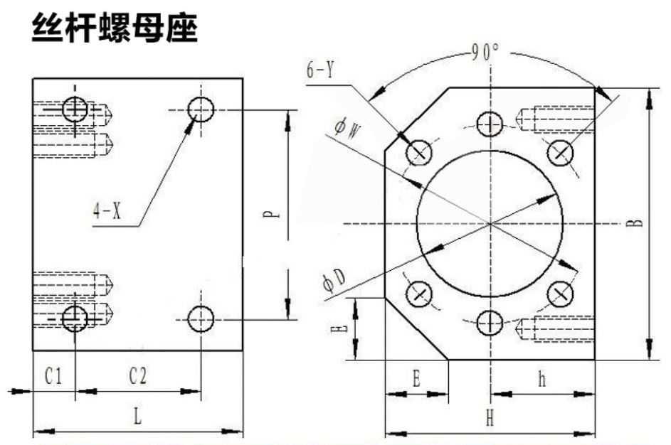

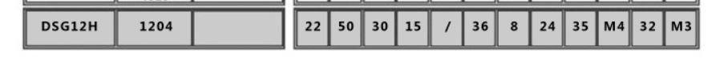

### Power Supply

Bench top power supply is used to provide a DC voltage for the test.

Note that this is different from a PWM controlled power supply. But this decision is made simply for reducing the unknown involved in these test. 

## Variables

The (large one) power supply is used and set at constant voltage mode with current limiting feature.

Different current limit is tested to simulate a different battery discharging capability: 2A to 7A

Different voltage is tested to simulate the effect of different battery voltage and PWM control: 2V- 14V

The motor is allowed to **run free until it is stalled**, power is then cut to avoid burning the motor. The screw typically rewinds itself due to stalled compressive force in the mechanical system. This is **repeated 5 times**. The **maximum pulling force recorded** from the load cell is logged as the maximum pulling force.

## Results

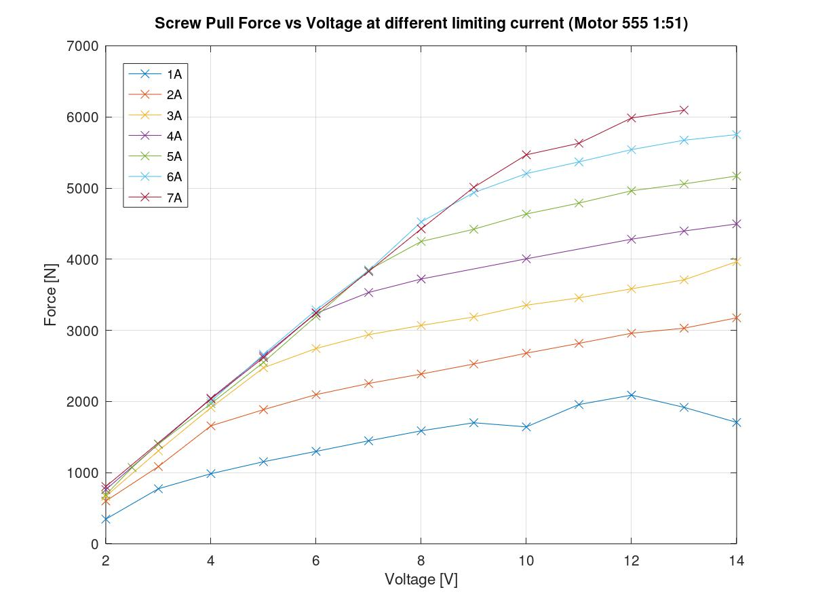

## Conclusion

### Maximum Pulling force vs Battery Voltage

The steeper initial diagonal slope represents a voltage limiting factor. Such as the case of a high discharge rate **LiPo battery**, operating at a certain voltage. The relationship is rather linear and consistent. 

This can be sued to deduce the **maximum pulling force** a specific **LiPo battery voltage** can deliver.

### Current Limiting

The less steep slope represent the current limiting situation. In the case where the current is limited, the maximum pulling force still improves as voltage increase. This is probably due to the higher speed that is built up during the free rotating phase of the test before the terminal force is reached, the momentum helped increase the force.

### Comparing two gearbox

The general trend of the two gear box are similar. But the graph is scaled to be higher.

The 1:100 gearbox have higher pull force (steeper initial slope) in the same testing voltage and current. It is very possible that if a high current is used in the test, the higher torque will damage some components.

It seems that the higher geared motor is more suitable to be used with a lower voltage battery where 

### Deliver 5kN force

Lets assume we would like to deliver 5kN of force for our application, which is should be enough for closing most joints. (This is yet to be confirmed with closure force test) . 

The 1:51 motor will require 9V and consumes 6A (assuming current is not limiting factor)

The 1:100 motor will require 4.5V and consuming 4A.

The 1:51 motor will spin **faster** and have more reserved **capacity for speed control**.

The 1:100 motor will be **slower** but have more chance to **overcome local stick-slip behavior**.

## Next Step

Repeat the test with a PWM controlled power supply.

Different PWM values are used and the maximum pulling force is observed.

(This future test will be performed with the L shaped jaw)

