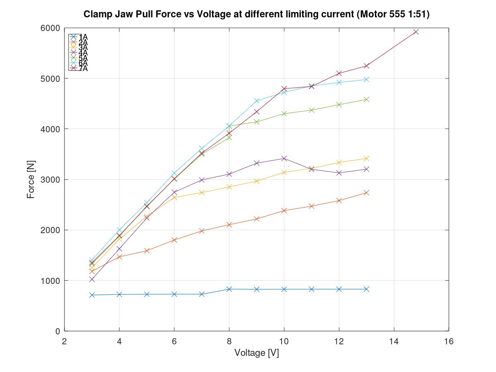
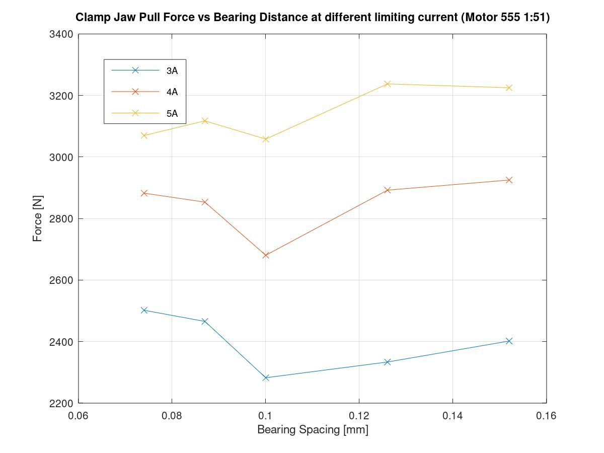
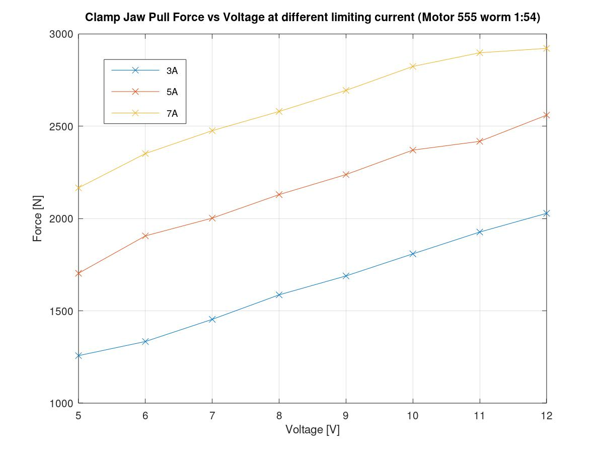
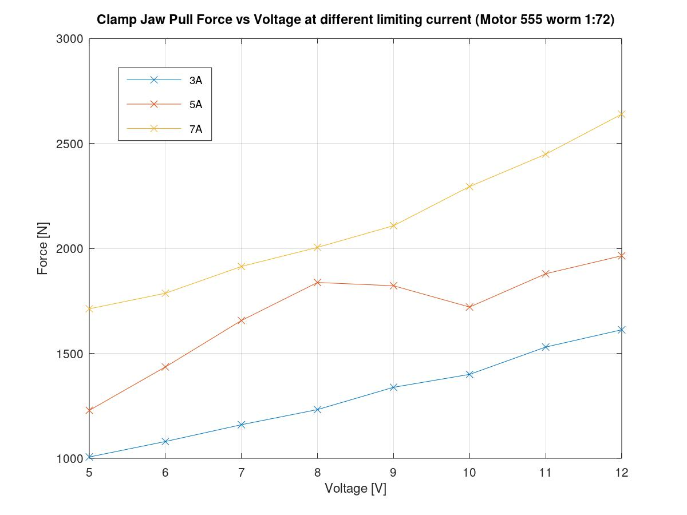

# Clamp Jaw Test

This set of test investigate the limiting criteria in jaw design. Especially in answering the following questions:

- Will the Linear Guide be overloaded?

- Can the linear guide be mounted cantilevered?

What is the minimum throat size of the L Shaped Jaw

What is the most flexible component in the system.

Motor 555 Gear 55:1

Test Date 2019-11-27 (till 28)

## Test 1 - Voltage vs Pull Force Test

The first test is to establish the relationship between voltage and pull force.

Similar to previous screw pull force test.

### Parameters

Different limiting current is used in each set, voltage is varied.

### Result

Note that the last data point of the 7A series at 14.4V is actually using the LiPo Battery as power source.

Two slopes can be seen here in the graph:

**The first steep slope** is when the motor is limited by the supplied voltage (Power supply in Constant voltage mode). Increase in supplied voltage is followed by an increase in supplied current. Therefore the motor can pull harder.

**The second slope** occurs at at point where the motor is limited by the set current limit. (Power supply is in constant current mode) The terminal current is limited and the motor will not be able to pull harder. However, there is still an increase in the pull force with voltage probably due to the higher voltage, hence faster motor speed and momentum, before terminal position. This momentum contribute to the final pulling force. 

## Test 2 - Spacing between linear bearing

Investigate different linear bearing spacing.

Look for difference in pull force, visual observation of L shape jaw deflection?

### Parameters

Test will involve 5 possible positions: 74mm, 87mm, 100mm, 126mm, 152mm.

Each position will use three different current: 3A, 4A, 5A

Voltage set beyond the current limit point of the 5A situation: 9V

### Result

Only one set of data is collected. Due to time consumption in relocating the bearing.

However, it is still conclusive that the bearing distance do not have much effect on the pull force. 

We can conclude that the bearing distance in the clamp design, is only limited by overloading.

The bearing distance can be further reduced to 66mm in final design.

## Test 3 - Two bolts mounting Linear Rail

Investigate when the linear rail is more cantilevered. When only the last two bolts are used to hold it.

### Parameters

Fixed Voltage at 14V, current increase from 3A upwards.

The steel U profile is modified. The previous hole for the screw to go through is too small, the screw scratches on the steel.

| Current | Pull Force (Max Value) |
| ------- | ---------------------- |
| 3       | 3154                   |
| 4       | 4459                   |
| 5       | 5167                   |
| 6       | 5138                   |
| 7       | 6086                   |

Only one set of pull test is performed. As the jaw successfully puled about 6kN, the test was not continued to avoid damaging components.

### Result

- The structure deformed but remain intact after repeated pull test. 
- The linear rail do not deform at all, the steel is very strong.
- The Linear bearings even though at only 74mm spacing, do not seem to be overloaded.
- The L Shape Jawdeform the most. Perhaps if the L piece have a triangulated chamfer, the jaw structure could be more stiff. However, the plat interfere with the screw bearing.

## Test 4 - Worm drive gearbox

Investigate if the 555 motor paired with the GW4058 1:54 or 1:72 gearbox will have similar pull strength. 

This gearbox is a major space-saver.

### Parameters

Different limiting current is used in each set, voltage is varied.

### Result

Worm gearbox cannot be back driven and the stored tension do not reverse the motor after power is removed.

It is surprising to see that the **1:54 gearbox perform better** than the 1:72 gearbox in similar voltage current setting. This is probably due to a lower efficiency of the 1:72 gearbox. 

The results seems to be much more linear than the planetary gearbox, without the distinctive 2 slopes.

Comparing with Test 1 which has a 1:51 planetary gearbox, the pull force is much lower. @ 7A 12V this gearbox can pull **2900N**, compared to **5100N** in Test 1.

### Li-Po Battery test

A follow up test using the 4 Cell Lipo Battery (14.8V 1300mAh 45-90C)

| Gear Box             | 1:54  | 1:72  |
| -------------------- | ----- | ----- |
| Pull Force with LiPo | 4900N | 4450N |

The pull force can reach **4900N** at stall. This implies it has the gearbox has the potential to deliver the high torque without damage. The 1:54 gearbox is performing better in this case too.

# General observations

The motor mount using the factory supplied L shape brackets is not ideal, the shaft coupler blocks the access to the M3 Screws. 

The U shaped steel for mounting load cell to the test base profile is deforming under load.

The aluminum L shaped jaw is permanently deformed by about 0.4 degrees. This should be improved in the final design.

The flat face plate in the jaw moved due the slippage. the oversized hole in the aluminums plate  allowed the M4 screws to move.  This should be restrained in the future.

# Next Step

A velocity controlled motor movement, using the feedback control and Arduino and motor driver board can be tested in this setup. It is important to see if the ultimate pulling force will be reduced under such controlled movement speed.

