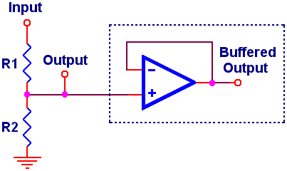

# Clamp Controller Electronics Development

The goal of the clamp controller is to be able to achieve the following high-level functions:

- Communicate wirelessly with a radio base station
  - Receive commands
  - Report status
  - Report a jammed stop during move
- Control 1 or 2 motors for the clamp's main linear movement
- Monitor sensors

## Motor driver and encoder

Each controller is designed to drive 1 or 2 DC motors with integrated hall effect sensor. A dual channel driving board is used for high voltage and current drive. Hall effect sensor can be read directly by Arduino.

### XY-160D motor driving board

**Driver input voltage:** DC 6.5V - 27V
**Number of Channels:** 2
**Rated output current:**  7A (Per Channel)
**PWM frequency range** 0-10 kHz (PWM signal at ENA input is used to regulate speed)

| Pin Function         | Label | Connection       | Pin | Name in Code |
| -------------------- | ----- | ---------------- | -------------------- | -------------------- |
| Drive Power Input +ve | 9-24V | Battery Positive |  |  |
| Drive Power Input -ve | PGND  | Battery Negative |  |  |
| Power Output - Channel 1 +ve	| OUT1  | Channel 1 Motor +ve |  |  |
| Power Output - Channel 1 -ve	| OUT2  | Channel 1 Motor -ve |  |  |
| Power Output - Channel 2 +ve	| OUT3  | Channel 2 Motor +ve |  |  |
| Power Output - Channel 2 -ve	| OUT4  | Channel 2 Motor -ve |  |  |
| Digital Power Input +ve	| +5V | Arduino 5V | 5V | |
| Digital Power Input -ve	| GND | Arduino Ground | GND | |
| Digital Input - Channel 1 - 1	| IN1   | Arduino GPIO |  | m1_driver_in1_pin |
| Digital Input - Channel 1 - 2	| IN2 | Arduino GPIO |  | m1_driver_in2_pin |
| Digital Input - Channel 2 - 1   | IN3 | Arduino GPIO |  | m2_driver_in1_pin |
| Digital Input - Channel 2 - 2   | IN4 | Arduino GPIO        |  | m2_driver_in2_pin |
| Digital Input - Channel 1 Speed	| ENA (near IN1) | Arduino GPIO (PWM)  |  | m1_driver_ena_pin |
| Digital Input - Channel 2 Speed	| ENA (near IN3) | Arduino GPIO (PWM)  |  | m2_driver_ena_pin |

Note: Motor +ve and -ve denote when the motor spins according to Right Hand Rule. (a.k.a. CCW when viewed from output end.)

### Hall Effect Sensor

The integrated hall sensor on the DC motors have clean square waveform. They have different resolution:

| Motor | Steps Per Revolutions | Max Freq |
| ----- | --------------------- | -------- |
| 775   | 15                    | 100kHz   |
| 555   | 11                    | 100kHz   |

The encoder has 4 pin connections.  

| Motor Channel | Pin Function         | Label | Connection       | Pin | Name in Code |
| -------------------- | ----- | ---------------- | -------------------- | -------------------- | -------------------- |
| 1 | Encoder Power Positive | VCC   | Arduino 5V | 5V |  |
| 1 | Encoder Power Negative | GND  | Arduino Ground | GND |  |
| 1	| Encoder Output - A Phase	| C1 | Arduino GPIO (Interrupt) |  | m1_encoder_c1_pin |
| 1	| Encoder Output - B Phase	| C2 | Arduino GPIO             |  | m1_encoder_c2_pin |
| 2 | Encoder Power Positive | VCC   | Arduino 5V | 5V |  |
| 2 | Encoder Power Negative | GND  | Arduino Ground | GND |  |
| 2	| Encoder Output - A Phase	| C1 | Arduino GPIO (Interrupt) |  | m1_encoder_c1_pin |
| 2	| Encoder Output - B Phase	| C2 | Arduino GPIO             |  | m1_encoder_c2_pin |

## Battery Voltage Monitor

Battery voltage is monitored with one of the analog input on Arduino via a voltage divider.

Voltage Divider Calculation: http://www.ti.com/download/kbase/volt/volt_div3.htm (E24 values)

| LiPo Cells | Charged Voltage | Empty Voltage | R1 (Ω) | R2 (Ω) | Power Diss (mW) | Converted Voltage |
| ---------- | --------------- | ------------- | ------ | ------ | --------------- | ----------------- |
| 1          | 4.2             | 3.7           | 0      | x      | 0               |                   |
| 2          | 8.4             | 7.4           | 680    | 1000   | 42              | 5.0               |
| 3          | 12.6            | 11.1          | 5100   | 3300   | 19              | 4.95              |
| 4          | 16.8            | 14.8          | 4300   | 1800   | 46              | 4.96              |

Empty battery has about 3.7/4.2 88% of the fully charged voltage. With the 1024 steps AnalogRead() on Arduino ADC, the theoretical resolution of the capacity measurement is 121 steps.

| Pin Function         | Label | Connection       | Pin | Name in Code |
| -------------------- | ----- | ---------------- | -------------------- | -------------------- |
| Battery Voltage Detection |       | Between R1 and R2 |  | battery_monitor_pin |