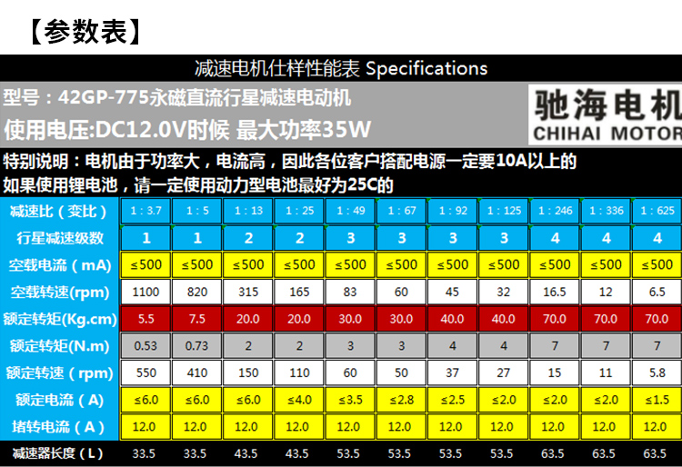
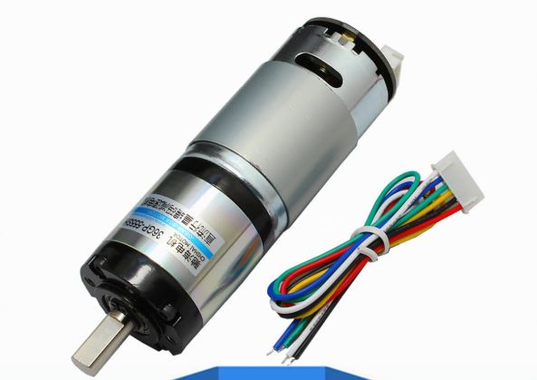
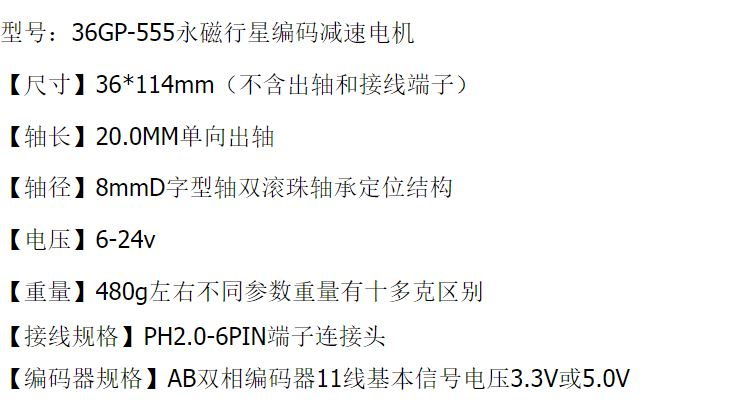
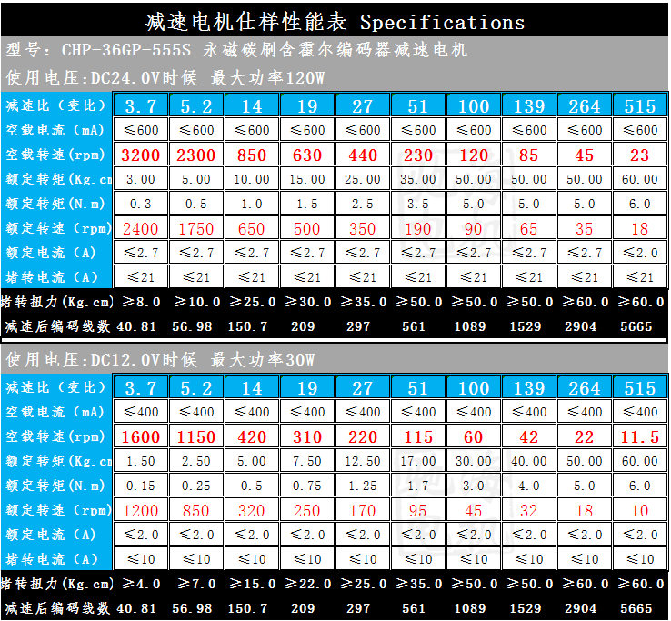
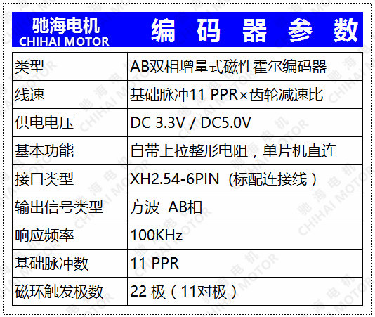
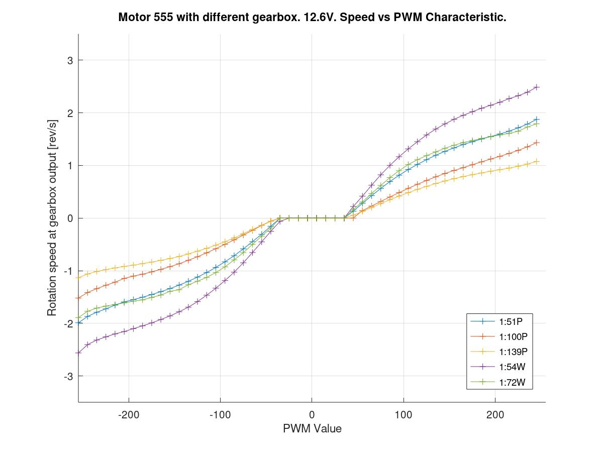
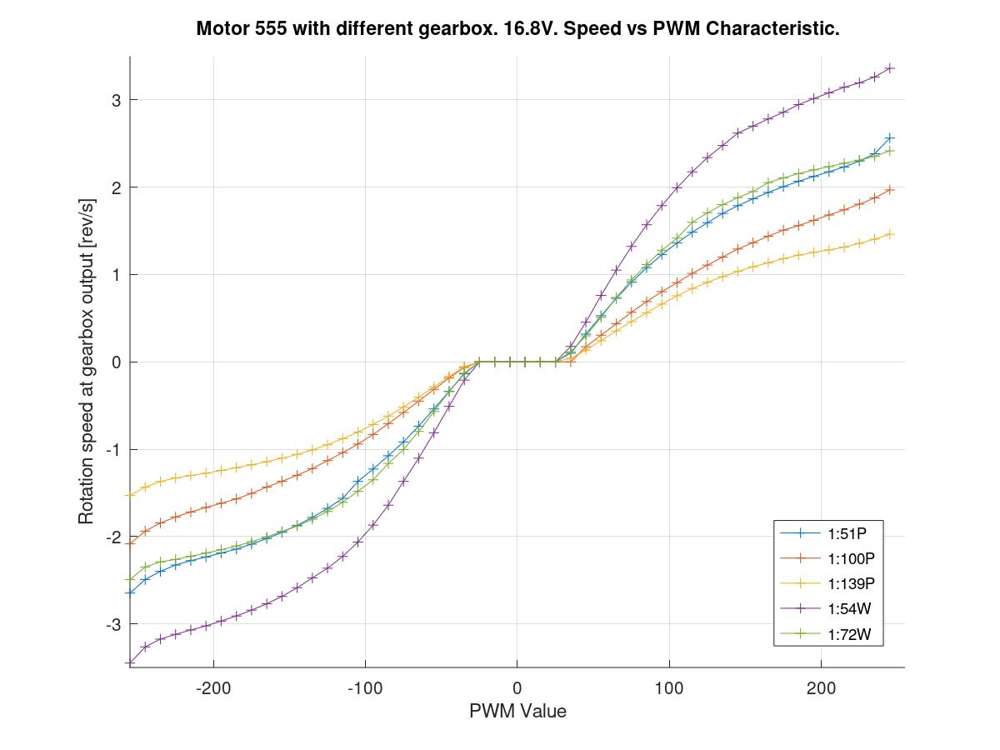

# DC Motor Control Tests

This series of test is part of the software development to perform **position and velocity** control for a DC motor with a **Hall effect** **Quadrature Decoder**. 

## Electronics setup

### **Controller**

Arduino Nano with new bootloader (Compiled firmware assumes it is Uno).

### Driver

The driver used is this module :

双路直流电机驱动板模块工业级马达正反转PWM调速L298逻辑7A160W

https://detail.tmall.com/item.htm?id=545415074433&spm=a1z09.2.0.0.32392e8dqyPg5S&_u=jl5jjmhde86 

PCB has markings: **XY-160D**

Posted Spec:

| Spec                    | Value              |
| ----------------------- | ------------------ |
| Power Supply Voltage    | 6.5 - 27V          |
| Current Per Channel     | 7A Max (50A surge) |
| Control Logic Voltage   | 3.0 - 6.5V         |
| PWN Frequency (ENA Pin) | 0 - 10kHz          |
| PCB Size                | 55x55x16mm         |
| Mounting hole size      | 3mm                |

Input Truth Table:

In1 In2 controls Out1 Out2 (Used for testing)

In3 In4 controls Out3 Out4

| ENA  | IN1  | IN2  | OUT1 OUT2 Effect             |
| ---- | ---- | ---- | ---------------------------- |
| x    | 0    | 0    | Short (Breaking)             |
| x    | 1    | 1    | Isolate                      |
| PWM  | 1    | 0    | Rotate (TODO: OUT1 > OUT2 ?) |
| PWM  | 0    | 1    | Rotate (TODO: OUT1 > OUT2 ?) |

### Motor

Two motors are used in the tests:

#### **42GP-775  with 1:49 Gearbox**

https://item.taobao.com/item.htm?spm=a1z09.2.0.0.32392e8dqyPg5S&id=538085471288&_u=jl5jjmh1acb 





#### **36GP-555  with 1:51 Gearbox**

 https://item.taobao.com/item.htm?spm=a1z09.2.0.0.32392e8dqyPg5S&id=544216961663&_u=jl5jjmhf0dd 










### Connections

Generally the following pins are used between Arduino and Driver / Encoder

```C++
#include "DCMotor.h"
const uint8_t m1_driver_ena_pin = 9;      // the pin the motor driver ENA1 is attached to (PWM Pin)
const uint8_t m1_driver_in1_pin = 8;      // the pin the motor driver IN1 is attached to
const uint8_t m1_driver_in2_pin = 7;      // the pin the motor driver IN2 is attached to
DCMotor Motor1(m1_driver_ena_pin, m1_driver_in1_pin, m1_driver_in2_pin);

#include "Encoder.h"
Encoder myEnc(2, 3);
```

### Encoder Details

The encoder on motor 775 has 15 pulse per rev per channel. The two channels combined have **60 pulse per rev**. The gear box is 1:49. Therefore the combined effect is 15 x 4 x 49 pulse = **2940 pulse per rev**.

The encoder on motor 555 has 11 pulse per rev per channel. The two channels combined have **44 pulse per rev**. The gear box is 1:51. Therefore the combined effect is 11 x 4 x 51 pulse = **2244 pulse per rev**.

-----

## Motor01_Encoder

Test to verify the Encoder library and the encoder on the motors are functional.

1. 13V is applied directly from PSU to motor. (Just quick test)

2. 10 turns are observed (eyeballed) , and then power is cut. 
3. Number of steps reported by the Arduino is recorded.

| Motor | Steps per 10 revolutions | Measured steps |
| ----- | ------------------------ | -------------- |
| 555   | 22440                    | 22428          |
| 775   | 29400                    | 29597          |

### Conclusion

Encoder is working alright, at least in one motor scenario. 

Encoder library and Arduino interrupt based counter is working okay. At least when pin (2,3) are used. Both of these pins are interrupt pins. 

### Next Steps

It is unsure in two motor scenario, if the encoder library is still operating fine.  

1. Arduino Nano only has 2 interrupt pins, in 2 motor scenario, each motor will only use one interrupt and one normal IO pin for encoder use.
2. There may be interrupt collision. 

## Motor02_EncoderSpeedTest

This test is copied from Encoder library default example to check if Arduino is catching up with the encoder interrupt speed.

This test is only performed using the 555 motor, 13V is applied directly from power supply to simulate the motor at fastest speed.

A voltage is measured from pin output 12 from Arduino.  If voltage drop to zero when encoder is fast, then the Arduino is not catching up.

// Test Result for 555 motor Encoder using 2 inturupt pins myEnc(2,3)
// 0V : 2.22,V
// 12V : 2.13V

// Test Result for 555 motor Encoder using 1 inturupt pins myEnc(2,4)
// 0V : 0.798V
// 12V : 0.781V


### Conclusion

Best case double interrupt `myEnc(2,3)` and single interrupt `myEnc(2,4)` have no problems reading the encoder at the motor's maximum speed.

### Next Steps

It is still unsure in two motor scenario, if the encoder library is still operating fine.  

1. There may be interrupt collision. 

## Motor_03_Voltage_Speed_Relationship

This test checks if the voltage speed relationship is linear.

Various voltage is applied from PSU to motor. These are DC voltage, not PWM controlled voltage.

### Testing setup

**Motor:** 42GP-775 with 1:49 gearbox (no load)

**Electronics:** Arduino micro + XY160D Driver + 12V AC wall adapter capable of 2A current

**Measurement:** Taken from Arduino's reading of the encoder


### Conclusion

DC motor voltage speed relationship is as linear as it gets.

## Motor04_PwmFreqEffect

This test finds the best PWM frequency such that the **PWM to Speed** relationship is as linear as possible, and has a large dynamic range for fine control.

Five PWM values are possible from Arduino settings standpoint, but only the 4 tested values are compatible with the motor driver's 10kHz limit.

### Result


### Conclusion

**3921.16Hz** seems to be the best option for dynamic range, although it clearly have a large deadband in the low PWM range. 

Use **3921.16Hz** in future PWM control.

### Next Steps

Perhaps a inner control loop or some offset is necessary to fix this deadband. Especially the later PID controller do not take into account this deadband and will traverse the zero crossing from positive to negative while loosing control.

At the moment, the PWM is set with a call to `DCMotor.setSpeed(pwm)`. Which directly sets the PWM.

The implementation of this function could take a dead band parameter and offset the output pwm by that amount.  The new implementation should distinguish `DCMotor.setPwm(int pwm)` and `DCMotor.setSpeedPercentage(float speedPercent)`

In our clamp application, the load is definitely not fixed. So mapping this response perfectly is not going to be meaningful. Therefore a lookup mapping table, or a regression fit is not attempted here.

## Motor04c_PWM_Different_Motor_Speed

The intention is to find out the different speed profile of different motors. 

To observe the difference in the deadband width.

To observe the maximum rpm for each motor under different voltages.

### Variables

Three motors:

- 36GP-555 with 1:51 gearbox (Gearbox might have been overloaded in other tests)
- 36GP-555 with 1:100 gearbox
- 36GP-775 with 1:49 gearbox

Different Supply Voltages will be tested:

- 16.8V (Simulated 4 Cell - Fully Charged)
- 14.8V (Simulated 4 Cell - Average)
- 12.6V (Simulated 3 Cell - Fully Charged)
- 11.1V (Simulated 3 Cell - Average)
- LiPo Battery (4 Cell)

Different PWM Values and direction

- +255 to -255 (PWM Frequency = 3921.16Hz) (Interval = 10)

### Test Setup

The code used is similar to **Motor04_PwmFreqEffect**. No deadband removal will be used.

Large benchtop power supply is used. Current Limit is 8A (Non current limiting )

### Result

**Comparing different voltage input characteristic:**

The difference in dead-band width is rather small in different voltage. (Less then 10 PWM ticks)


**Comparing motor with different gearbox:**

The no load speed difference between 1:100 (slower) and 1:51 (faster) is not even close to 2.0

This is probably due to load by the loss in gearbox. Thus the 1:51 does not move close to two time the speed.





### Implication / Next step

The following chart gives the no load linear speed when using the 1204 screw. Bracket is the advertised value on data sheet.


| Supply voltage [V] | Gear Ratio | Encoder Speed [step/s] | No load Speed [rev/s] | Linear Speed 1204 Screw [mm/s] |
| ------------------ | ---------- | ---------------------- | --------------------- | ------------------------------ |
| 12.6               | 1:51       | 4465                   | 1.9897 (1.916)        | 7.959                          |
| **16.8**           | **1:51**   | **5941**               | **2.6475**            | **10.590**                     |
| 12.6               | 1:100      | 6686                   | 1.5195 (1.0)          | 6.0782                         |
| 16.8               | 1:100      | 9168                   | 2.0836                | 8.3345                         |

If we use 50% of the capacity of the output from the 1:51 motor,  under 16.8V power supply. The linear speed will be approximately 5mm/s and thus a 120mm stroke will take 24s. 

This hints towards the synchronization test to try speed in the range of 3 to 5 mm/s

## Motor04b_PwmWithoutDeadband

This test confirms if the PWM deadband removal can remove the large deadband when the PWM values crosses from positive to negative.

PWM 3921.16 Hz is used for the test.

The implementation of the deadband removal avoids very low PWM being applied to motor which are certainly not doing anything.

```c++
void DCMotor::setSpeedPercent(double speedPercent) {
    if (speedPercent == 0) stop();

    else if (speedPercent > 0) {
        digitalWrite(_pin_in1, LOW);
        digitalWrite(_pin_in2, HIGH);
    } else if (speedPercent < 0) {
        digitalWrite(_pin_in1, HIGH);
        digitalWrite(_pin_in2, LOW);
    }
    //Make speed absolute value, map the value to avoid deadband
    double hamonizedSpeed = abs(speedPercent);
    hamonizedSpeed = min(hamonizedSpeed, 1.0);
    int pwm = (255 - _PWMDeadband) * hamonizedSpeed + _PWMDeadband;
    analogWrite(_pin_ena, pwm);
    _running = true;
}
```

Note: The test is performed from negative value to positive value, some hysteresis can be observed in the system.

### Result


**Deadband 30** appears to be the most continuous through the zero crossing. 

The discontinuous part observed shows some hysteresis. The motor need higher "PWM Value" when it is trying to accelerate from zero speed.

### Conclusion

Use Deadband 30. 

### Next Steps

It is not sure if this deadband implementation will actually helps the following PID control or not. 


## Motor05_PID_Velocity

This is not a test but a base script to verify <PID_v1.h> library.  

The PID is set to a low kp gain to simplify things, the system therefore takes a while to settle. The goal here is not to tune the PID but to verify that the PID can maintain different speed at a reasonable precision.

The PID controller was programmed to maintain different speed. From -1.4

Settling Time before measurement: 2s

Number of samples: 40

Sampling Interval 0.1s

 Which Motor Used ? 

### Result


### Conclusion

The speed controlling accuracy of the PID in this system is within 3% , even without tuning the PID. This is good enough for many things.

However, our goal is position control and motion profile control, this set of result is not conclusive to how well it will follow motion profile.

The use of deadband 30 does not seem to affect the steady error.  This means the PID can take care of the non-linear behavior of the PWM vs Speed problem. However, deadband 30 might be more responsive to velocity changes, which, this result cannot reflect.

## Motor07_PID_MotionProfile

A rectangular motion profile is used for the PID to follow as a positional feedback control.

A speed of 2000step/s (approximately half of the maximum speed) is used as cruising speed. Acceleration and deceleration is instantaneous. Positional error of the system is plotted.

Settling time and error and ocillation are observed at t=0ms and t = 2000ms where acceleration and deceleration occur.


A manual tuning is used to find a good error response.

### Testing setup

**Motor:** 42GP-775 with 1:49 gearbox (no load)

**Electronics:** Arduino micro + XY160D Driver + 12V AC wall adapter capable of 2A current

**Measurement:** Taken from Arduino's reading of the encoder

### Tuning process

**Result 01**

The following graph, **kp is changed**, larger Kp seems more responsive. Steady offset is observed.


**Result 02**

The following step, **ki is tuned**, increasing the ki seems to result in less steady time error.


**Result 03**

Next step **Kd is added**. increase in kd seems to have dampen the position error nicely 

kd = 0.0004 is almost critically dampened, however, a vibration/chattering is heard when run.


The following setSpeedPercent() output plot shows that ki=0.0002 and 0.0004 have quite a bit of jitter.


**Result 04**

Back to **tuning Kp**. Further increase in Kp results in much less settling time and much less initial error.

However, it slightly worsens the steady state error and also causes output jitter


**Result 05**

0.04kp is selected and see if further increase in ki will reduce stead state error

Here, K=0.2 and 0.4 can quickly go back to a mean zero error. But again quite large oscillation and jitter.


**Result 06**

Here, the effect of both ki (0.1 and 0.2) and kd (0.0001 and 0.0002) is investigated.

The purple line (ki = 0.2 and kd = 0.0002) seems to be most promising. It has the least amount of micro oscillation and settle within 5step of error in about 300ms.


**Result 07**

Finally we look at how these particularly tuned PID values for 2000 steps/s operate in other speeds (1000 - 4000step/s )

We can see that higher target speed have a higher stable state error. There is a constant 20 steps error at 4000step/s. The output of the PID also saturates in the first 300ms, showing a full acceleration.


### Conclusion

In general this is a usable controller for following a motion profile. 

The tune is kP = 0.04, kI = 0.20, kD = 0.0002

(Note that this tuning is only applicable for the 775 motor in no load case.)

Despite the acceleration and deceleration period is slightly out of control, it generally deviate less than a 100 steps (12 degrees where one rev has 2940 steps ). At cruising speed, it deviate less than 20 steps (2.5 degrees)

### Next Steps

It is possible that "proportional on measurement" instead of "proportional on error" can have better response. 

It is possible that a trapezoidal velocity profile will allow a more controlled acceleration and deceleration. 

It is possible that a feed forward control with a "velocity feedforward" will help compensate different steady-state error when different speed is used.


## Motor08_PID_TrapezoidalMotionProfile

Date: 2019-10-21


This is the development and validation of a **trapezoidal motion profile generator**. This results in three classes within `MotionProfile.cpp` file.

- `MotionProfile`  - Base class that implemented time keeping methods
- `LinearMotionProfile`  - Linear speed profile with constant velocity
- `TrapezoidalMotionProfile` - Trapezoidal speed profile with acceleration and deceleration phase

The **PID controller** from previous experiment was use with values:

- kP = 0.04, kI = 0.20, kD = 0.0002

### Testing setup

**Motor:** 42GP-555 with 1:51 gearbox (2244 step/rev)

**Load:** No load

**Electronics:** Arduino micro + XY160D Driver + 12.6V (8A Max)

**Measurement:** Taken from Arduino's reading of the encoder

**Previous Test have established the maximum speed**:

- 5941 step/s @ 16.8V

- 4465step/s @ 12.6V

### Variables

**Running Speed** 2805 step/s (1.25 rpm / 5mm/s @ 1204 screw)

**Different acceleration** (equal to deceleration) is tested with the same PID values

**Step Error** during the entire time is logged and returned.

### Results


## Motorxx_Stopping_Condition_PosError

This experiment investigate the pulling force generated by the clamping jaw when the PID controller is active. And **how the force build up until the stopping condition**. This is in preparation for the clamp controller to follow a motion profile while providing good pulling force against resistance.

This is the first position controlled test that involved a force measurement.

When the motors are overloaded, jammed or stalled by resistance, the motion controller needs to cut power to **avoid burning out the motor** and also to **report back to the higher control layer** that it is jammed.

Two stopping conditions are possible and this and the next experiment verify what is a good stopping (jammed) condition for the motion controller. Basic assumption can be:

- Position error is larger than a threshold (Probably easier to sync)
- Speed is approaching zero (Pull as hard as possible)

This experiment investigate the **speed approach** using **different speed threshold.**

### Independent Variable

Stopping condition - speed threshold

### Dependent Variable

Terminal / Maximum Pull Force

### Testing conditions

Motor used is 555 gearbox 1:55 (instead of the 1:100 to avoid accidental overloading and breaking other parts).

Testing jig is similar to the linear guide jaw test.


Voltage supply (**12V**) with capped current (**7A**) by the large Power Supply

Observation: Position Error / Speed / Force

